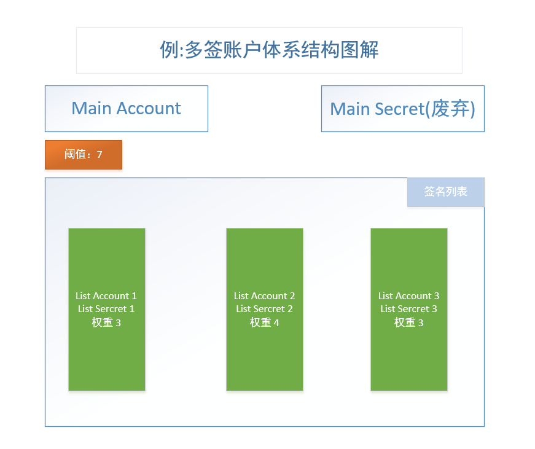
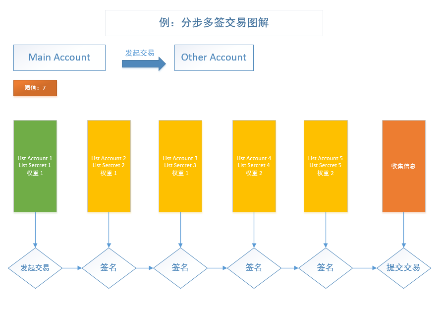

## 多重签名概念介绍


### 概念

在现实生活中，一份文件经常需要几个单位或部门分别签字(或盖章)才有效，多重签名技术就是在网络环境里解决这类问题的一种方法，用于同一文档必须经过多人的签名才有效的情形。多重签名通俗地讲就是指多个签名者共同参与对一份电子文档进行签名。简单地说，一个多重签名体制回答这样几个问题：哪些人参加签名，按照什么顺序签名，使用什么方法签名，怎么验证签名和安全性如何得到保证。[百度百科](https://baike.baidu.com/item/%E5%A4%9A%E9%87%8D%E7%AD%BE%E5%90%8D)

### 介绍

多重签名意味着在交易发生之前需要多个签名或批准。多重签名会增加加密货币的安全性，这样一个人就不能在未经他人同意的情况下把所有的数字货币都拿走。

### 费用

多签名交易需要更大的SWT费用进行分配,当前的费用为 (签名数量 * 0.01) SWT。

### 简易流程介绍



> 如上图中，多签的账号基本体系

* 主账号有一个多签列表
* 主账号有一个阈值
* 主账号的私钥需要废弃
* 签名账号需要有权重
* 发起交易时，签名账号进行对交易签名，权重相加不小于阈值即可发出交易

## 设置帐号的多重签名列表

### 类型 

POST 

### 描述

设置帐号的多重签名列表


### 请求地址
```
{{host}}/multisign/:account/signerlist
```

### 参数说明

#### 参数示例

```JSON
{	
	"secret": "spAvJzHQZAWAh2SxYDiNrgHpbs6FU",
	"threshold": 7,
	"lists":[
		{
			"account": "jEdMhnqsN228jvqnedtY8QGbmH99Pq63MM",
			"weight": 6
		},
		{
			"account": "jGg9QzGsMTtPU9DgU4TEMi69LLyrPzfdqf",
			"weight": 5
		}
	]
}
```

#### 参数介绍

| 参数             | 位置 | 类型    | 说明         |
|------------------|------|---------|------------|
| account          | Path | String  | 井通账户     |
| secret           | Body | String  | 井通钱包私钥 |
| threshold        | Body | Integer | 阈值         |
| lists            | Body | String  | 签名列表     |
| lists[n].account | Body | String  | 帐号         |
| lists[n].weight  | Body | Integer | 权重         |


#### 返回值示例

```JSON
{
    "success": true,
    "msg": "成功",
    "code": 0,
    "data": {
        "engine_result": "tesSUCCESS",
        "engine_result_code": 0,
        "engine_result_message": "The transaction was applied. Only final in a validated ledger.",
        "tx_blob": "1200CF22000000002400000419202600000007684000000000004E207321021B1C36F0F139ECED522465931053552AB6FDDC138042A5CA19DAAB41CBA12F1A7446304402206ECBC35002457B35AEF767D69BB506DBE8C770D13499AA49E25FBDAEC01BD97C0220398E72405B76D85BD7AC5D7A44D875CFEF20D773866622A4800A771607391EAE811465121D16DE65D7AF3E9EBB8DB96C98B453060844FBEC1300068114A07179A23C75F187433ED5DD7CFD937F277A4930E1EC1300058114ABF121EFAD590A86BFB54AA7A0CD6390EBFBEF22E1F1",
        "tx_json": {
            "Account": "jwDQAAh3aEH74cSx5kLvxHGf9t248pFqyk",
            "Fee": "20000",
            "Flags": 0,
            "Sequence": 1049,
            "SignerEntries": [
                {
                    "SignerEntry": {
                        "Account": "jEdMhnqsN228jvqnedtY8QGbmH99Pq63MM",
                        "SignerWeight": 6
                    }
                },
                {
                    "SignerEntry": {
                        "Account": "jGg9QzGsMTtPU9DgU4TEMi69LLyrPzfdqf",
                        "SignerWeight": 5
                    }
                }
            ],
            "SignerQuorum": 7,
            "SigningPubKey": "021B1C36F0F139ECED522465931053552AB6FDDC138042A5CA19DAAB41CBA12F1A",
            "TransactionType": "SignerListSet",
            "TxnSignature": "304402206ECBC35002457B35AEF767D69BB506DBE8C770D13499AA49E25FBDAEC01BD97C0220398E72405B76D85BD7AC5D7A44D875CFEF20D773866622A4800A771607391EAE",
            "hash": "473F918C173019F8A72E982BAA2A8E691374FB2AAA6806BE0C925569367DB427"
        }
    }
}
```
#### 返回值解析

| 参数                                                   | 类型    | 说明                                                   |
|--------------------------------------------------------|---------|------------------------------------------------------|
| success                                                | Boolean | 此次请求是否成功                                       |
| msg                                                    | String  | 返回的信息                                             |
| code                                                   | Integer | 服务器返回的请求状态码                                 |
| data                                                   | String  | 数据或者错误信息                                       |
| data.engine_result                                     | String  | 请求结果                                               |
| data.engine_result_code                                | Array   | 请求结果编码                                           |
| data.engine_result_message                             | String  | 请求结果message信息                                    |
| data.tx_blob                                           | String  | 16进制签名后的交易                                     |
| data.tx_json                                           | Object  | 交易内容                                               |
| data.tx_json.Account                                   | String  | 交易源账号地址                                         |
| data.tx_json.Fee                                       | String  | 交易费                                                 |
| data.tx_json.Flags                                     | Integer | 交易标记                                               |
| data.tx_json.Sequence                                  | Integer | 单子序列号                                             |
| data.tx_json.SignerEntries                             | Array   | 签名列表条目；销毁列表时，没有该字段                     |
| data.tx_json.SignerEntries[n].SignerEntry              | Object  | 单个签名条目                                           |
| data.tx_json.SignerEntries[n].SignerEntry.Account      | String  | 签名账号的地址                                         |
| data.tx_json.SignerEntries[n].SignerEntry.SignerWeight | String  | 该签名在多重签名交易中的权重                           |
| data.tx_json.SignerQuorum                              | Integer | 多重签名交易通过的阈值，应大于等于零，零表示销毁签名列表 |
| data.tx_json.SigningPubKey                             | String  | 签名公钥                                               |
| data.tx_json.TransactionType                           | String  | 交易类型，设置签名列表类为SignerListSet                 |
| data.tx_json.TxnSignature                              | String  | 交易签名                                               |
| data.tx_json.hash                                      | String  | 交易hash                                               |

## 废除帐号的主秘钥

### 类型 

POST 

### 描述

废除帐号的主秘钥，设置账号的多签列表之后可以废弃账号的主秘钥。让此账号只能通过多签方式进行交易。


### 请求地址
```
{{host}}/multisign/:account/abolish
```

### 参数说明

#### 参数示例

```JSON
{	
	"secret": "spAvJzHQZAWAh2SxYDiNrgHpbs6FU"
}
```

#### 参数介绍

| 参数    | 位置 | 类型   | 说明         |
|---------|------|--------|------------|
| account | Path | String | 井通账户     |
| secret  | Body | String | 井通钱包私钥 |

#### 返回值示例

```JSON
{
    "success": true,
    "msg": "成功",
    "code": 0,
    "data": {
        "engine_result": "tesSUCCESS",
        "engine_result_code": 0,
        "engine_result_message": "The transaction was applied. Only final in a validated ledger.",
        "tx_blob": "1200032200000000240000041A2021000000046840000000000027107321021B1C36F0F139ECED522465931053552AB6FDDC138042A5CA19DAAB41CBA12F1A74473045022100DBAA5889992C27E559F1B5D27C39B3BE4B46D8522C026C9A917FD1DE135BBAD5022007C443680601F354975C26424D06E548EDC28A477C5C0726D4C25E593F4537EA811465121D16DE65D7AF3E9EBB8DB96C98B453060844",
        "tx_json": {
            "Account": "jwDQAAh3aEH74cSx5kLvxHGf9t248pFqyk",
            "Fee": "10000",
            "Flags": 0,
            "Sequence": 1050,
            "SetFlag": 4,
            "SigningPubKey": "021B1C36F0F139ECED522465931053552AB6FDDC138042A5CA19DAAB41CBA12F1A",
            "TransactionType": "AccountSet",
            "TxnSignature": "3045022100DBAA5889992C27E559F1B5D27C39B3BE4B46D8522C026C9A917FD1DE135BBAD5022007C443680601F354975C26424D06E548EDC28A477C5C0726D4C25E593F4537EA",
            "hash": "C9DCA65181F624F6DA763BC7CCDFF3EE7DB598C61C01FD507381107487650BC3"
        }
    }
}
```
#### 返回值解析

| 参数                         | 类型    | 说明                            |
|------------------------------|---------|-------------------------------|
| success                      | Boolean | 此次请求是否成功                |
| msg                          | String  | 返回的信息                      |
| code                         | Integer | 服务器返回的请求状态码          |
| data                         | String  | 数据或者错误信息                |
| data.engine_result           | String  | 请求结果                        |
| data.engine_result_code      | Array   | 请求结果编码                    |
| data.engine_result_message   | String  | 请求结果message信息             |
| data.tx_blob                 | String  | 16进制签名后的交易              |
| data.tx_json                 | Object  | 交易内容                        |
| data.tx_json.Account         | String  | 交易源账号地址                  |
| data.tx_json.Fee             | String  | 交易费                          |
| data.tx_json.Flags           | Integer | 交易标记                        |
| data.tx_json.Sequence        | Integer | 单子序列号                      |
| data.tx_json.SetFlag         | Integer | 账号属性标记                    |
| data.tx_json.SigningPubKey   | String  | 签名公钥                        |
| data.tx_json.TransactionType | String  | 交易类型，账号属性类为AccountSet |
| data.tx_json.TxnSignature    | String  | 交易签名                        |
| data.tx_json.hash            | String  | 交易hash                        |

## 激活帐号的主秘钥

### 类型 

POST 

### 描述

激活帐号的主秘钥。


### 请求地址
```
{{host}}/multisign/:account/activate
```

### 参数说明

#### 参数示例

```JSON
{	
	"lists":[
		{
			"account": "jEdMhnqsN228jvqnedtY8QGbmH99Pq63MM",
			"secret": "xxx"
		},
		{
			"account": "jGg9QzGsMTtPU9DgU4TEMi69LLyrPzfdqf",
			"secret": "xxx"
		}
	]
}
```

#### 参数介绍

| 参数             | 位置 | 类型   | 说明               |
|------------------|------|--------|------------------|
| account          | Path | String | 井通账户           |
| lists            | Body | Array  | 多签列表的地址列表 |
| lists[n].account | Body | String | 多签列表的井通账户 |
| lists[n].secret  | Body | String | 井通钱包私钥,如果  |

#### 返回值示例

```JSON
{
    "success": true,
    "msg": "成功",
    "code": 0,
    "data": {
        "success": true,
        "data": {
            "engine_result": "tesSUCCESS",
            "engine_result_code": 0,
            "engine_result_message": "The transaction was applied. Only final in a validated ledger.",
            "tx_blob": "1200032200000000240000041B202200000004684000000000004E207300811465121D16DE65D7AF3E9EBB8DB96C98B453060844FCED732102AD74919EC33209E996DB9568AB50325E0C81CA25F71FFD632BC3AA9F2EBC59F074473045022100DAD554B7AFA32822F8D6C3FA7EC38B8EB083216053D20F509A4375DB6FFE909D02206B039B8C3D3B55DEDB997F18BF1890BF295ACB27BF6372F094667BD18BD4C1368114A07179A23C75F187433ED5DD7CFD937F277A4930E1ED7321023094E58CDBAF5275E0082D4B207865EFAB450BAEBD253E98E0812CB83D5C40F77447304502210096A32B19064B90EE9973608C3A8BBF6E6558295ABFFFC49263C45CEB28831B5402202530A649753862C05F6B2272B48BC0F3CD1E09876C2E76AF6FD483B9A5ABF29E8114ABF121EFAD590A86BFB54AA7A0CD6390EBFBEF22E1F1",
            "tx_json": {
                "Account": "jwDQAAh3aEH74cSx5kLvxHGf9t248pFqyk",
                "ClearFlag": 4,
                "Fee": "20000",
                "Flags": 0,
                "Sequence": 1051,
                "Signers": [
                    {
                        "Signer": {
                            "Account": "jEdMhnqsN228jvqnedtY8QGbmH99Pq63MM",
                            "SigningPubKey": "02AD74919EC33209E996DB9568AB50325E0C81CA25F71FFD632BC3AA9F2EBC59F0",
                            "TxnSignature": "3045022100DAD554B7AFA32822F8D6C3FA7EC38B8EB083216053D20F509A4375DB6FFE909D02206B039B8C3D3B55DEDB997F18BF1890BF295ACB27BF6372F094667BD18BD4C136"
                        }
                    },
                    {
                        "Signer": {
                            "Account": "jGg9QzGsMTtPU9DgU4TEMi69LLyrPzfdqf",
                            "SigningPubKey": "023094E58CDBAF5275E0082D4B207865EFAB450BAEBD253E98E0812CB83D5C40F7",
                            "TxnSignature": "304502210096A32B19064B90EE9973608C3A8BBF6E6558295ABFFFC49263C45CEB28831B5402202530A649753862C05F6B2272B48BC0F3CD1E09876C2E76AF6FD483B9A5ABF29E"
                        }
                    }
                ],
                "SigningPubKey": "",
                "TransactionType": "AccountSet",
                "hash": "792692CA3539A34F06FD91D4801A114B4C0D8305E75741E51A3D6E5C4D8A39F3"
            }
        }
    }
}
```
#### 返回值解析

| 参数                                         | 类型    | 说明                               |
|----------------------------------------------|---------|----------------------------------|
| success                                      | Boolean | 此次请求是否成功                   |
| msg                                          | String  | 返回的信息                         |
| code                                         | Integer | 服务器返回的请求状态码             |
| data                                         | String  | 数据或者错误信息                   |
| data.engine_result                           | String  | 请求结果                           |
| data.engine_result_code                      | Array   | 请求结果编码                       |
| data.engine_result_message                   | String  | 请求结果message信息                |
| data.tx_blob                                 | String  | 16进制签名后的交易                 |
| data.tx_json                                 | Object  | 交易内容                           |
| data.tx_json.Account                         | String  | 交易源账号地址                     |
| data.tx_json.ClearFlag                       | Integer | 账号属性标记                       |
| data.tx_json.Fee                             | String  | 交易费                             |
| data.tx_json.Flags                           | Integer | 交易标记                           |
| data.tx_json.Sequence                        | Integer | 单子序列号                         |
| data.tx_json.SigningPubKey                   | String  | 签名公钥                           |
| data.tx_json.TransactionType                 | String  | 交易类型，账号属性类为AccountSet    |
| data.tx_json.hash                            | String  | 交易hash                           |
| data.tx_json.Signers                         | Array   | 签名列表条目；销毁列表时，没有该字段 |
| data.tx_json.Signers[n].Signer               | Object  | 单个签名条目                       |
| data.tx_json.Signers[n].Signer.Account       | String  | 给该交易签名的账号地址             |
| data.tx_json.Signers[n].Signer.SigningPubKey | String  | 给该交易签名的账号公钥             |
| data.tx_json.Signers[n].Signer.TxnSignature  | String  | Account账号给该交易的交易签名      |

## 直接多重签名交易

### 类型 

POST 

### 描述

多重签名交易。此接口是直接进行多签交易，需要收集到权重大于阈值的所有的地址和私钥，传入参数直接进行交易操作。


### 请求地址
```
{{host}}/multisign/pay
```

### 参数说明

#### 参数示例

```JSON
{
    "account": "jwDQAAh3aEH74cSx5kLvxHGf9t248pFqyk",
    "to": "jpUCa7JwSbwvU1adNXRN7BWzTeVsTiNp1i",
    "value": "0.0001",
    "currency": "TEST",
    "issuer": "jGa9J9TkqtBcUoHe2zqhVFFbgUVED6o9or",
    "addMemo": "测试测试测试测试测试测试测试测试测试测试测试测试测试测试测试测试",
    "lists":[
		{
			"account": "jEdMhnqsN228jvqnedtY8QGbmH99Pq63MM",
			"secret": "xxx"
		},
		{
			"account": "jGg9QzGsMTtPU9DgU4TEMi69LLyrPzfdqf",
			"secret": "xxx"
		}
	]
}
```

#### 参数介绍

| 参数             | 位置 | 类型    | 说明                                        |
|------------------|------|---------|-------------------------------------------|
| account          | Body | String  | 发起账号                                    |
| to               | Body | String  | 目标账号                                    |
| value            | Body | String  | 支付数量                                    |
| currency         | Body | String  | 货币种类，三到六个字母或 20 字节的自定义货币 |
| issuer           | Body | String? | 货币发行方，无则留 ''                        |
| addMemo          | Body | String? | 备注信息                                    |
| lists            | Body | Array   | 多签列表的地址列表                          |
| lists[n].account | Body | String  | 多签列表的井通账户                          |
| lists[n].secret  | Body | String  | 井通钱包私钥                                |

#### 返回值示例

```JSON
{
    "success": true,
    "msg": "成功",
    "code": 0,
    "data": {
        "engine_result": "tesSUCCESS",
        "engine_result_code": 0,
        "engine_result_message": "The transaction was applied. Only final in a validated ledger.",
        "tx_blob": "1200002200000000240000041C61D3838D7EA4C680000000000000000000000000544553540000000000A582E432BFC48EEDEF852C814EC57F3CD2D41596684000000000004E207300811465121D16DE65D7AF3E9EBB8DB96C98B45306084483140D2C803B102F69C7AF902747C0CE6B0C90CF869AF9EA7D60E6B58BE8AF95E6B58BE8AF95E6B58BE8AF95E6B58BE8AF95E6B58BE8AF95E6B58BE8AF95E6B58BE8AF95E6B58BE8AF95E6B58BE8AF95E6B58BE8AF95E6B58BE8AF95E6B58BE8AF95E6B58BE8AF95E6B58BE8AF95E6B58BE8AF95E6B58BE8AF95E1F1FCED732102AD74919EC33209E996DB9568AB50325E0C81CA25F71FFD632BC3AA9F2EBC59F07446304402206F6857C872D968670415B315E9F8E8FB461CA79439AB7187E0AF473FC4C2B527022000C36170CA083336E504E9F862AF6EF68CCDC1D643A1AAC4746C0CD196D754C98114A07179A23C75F187433ED5DD7CFD937F277A4930E1ED7321023094E58CDBAF5275E0082D4B207865EFAB450BAEBD253E98E0812CB83D5C40F7744730450221009F92252E03AD29B4DD6E87560E8029113BFCE7604238E2D2E11EA67CBEE4E16A02202476D3FBA7003EA49CE4EFFD13A0D9BFBA95ECC23C91C02D0C46B30B9A1E5F9A8114ABF121EFAD590A86BFB54AA7A0CD6390EBFBEF22E1F1",
        "tx_json": {
            "Account": "jwDQAAh3aEH74cSx5kLvxHGf9t248pFqyk",
            "Amount": {
                "currency": "TEST",
                "issuer": "jGa9J9TkqtBcUoHe2zqhVFFbgUVED6o9or",
                "value": "0.0001"
            },
            "Destination": "jpUCa7JwSbwvU1adNXRN7BWzTeVsTiNp1i",
            "Fee": "20000",
            "Flags": 0,
            "Memos": [
                {
                    "Memo": {
                        "MemoData": "E6B58BE8AF95E6B58BE8AF95E6B58BE8AF95E6B58BE8AF95E6B58BE8AF95E6B58BE8AF95E6B58BE8AF95E6B58BE8AF95E6B58BE8AF95E6B58BE8AF95E6B58BE8AF95E6B58BE8AF95E6B58BE8AF95E6B58BE8AF95E6B58BE8AF95E6B58BE8AF95"
                    }
                }
            ],
            "Sequence": 1052,
            "Signers": [
                {
                    "Signer": {
                        "Account": "jEdMhnqsN228jvqnedtY8QGbmH99Pq63MM",
                        "SigningPubKey": "02AD74919EC33209E996DB9568AB50325E0C81CA25F71FFD632BC3AA9F2EBC59F0",
                        "TxnSignature": "304402206F6857C872D968670415B315E9F8E8FB461CA79439AB7187E0AF473FC4C2B527022000C36170CA083336E504E9F862AF6EF68CCDC1D643A1AAC4746C0CD196D754C9"
                    }
                },
                {
                    "Signer": {
                        "Account": "jGg9QzGsMTtPU9DgU4TEMi69LLyrPzfdqf",
                        "SigningPubKey": "023094E58CDBAF5275E0082D4B207865EFAB450BAEBD253E98E0812CB83D5C40F7",
                        "TxnSignature": "30450221009F92252E03AD29B4DD6E87560E8029113BFCE7604238E2D2E11EA67CBEE4E16A02202476D3FBA7003EA49CE4EFFD13A0D9BFBA95ECC23C91C02D0C46B30B9A1E5F9A"
                    }
                }
            ],
            "SigningPubKey": "",
            "TransactionType": "Payment",
            "hash": "0D67AAE42FC08ABBFBD221D5C1E98FA06228D0F23587F4780268688ABFE8C343"
        }
    }
}
```
#### 返回值解析

| 参数                                         | 类型    | 说明                                                                        |
|----------------------------------------------|---------|---------------------------------------------------------------------------|
| success                                      | Boolean | 此次请求是否成功                                                            |
| msg                                          | String  | 返回的信息                                                                  |
| code                                         | Integer | 服务器返回的请求状态码                                                      |
| data                                         | String  | 数据或者错误信息                                                            |
| data.engine_result                           | String  | 请求结果                                                                    |
| data.engine_result_code                      | Array   | 请求结果编码                                                                |
| data.engine_result_message                   | String  | 请求结果message信息                                                         |
| data.tx_blob                                 | String  | 16进制签名后的交易                                                          |
| data.tx_json                                 | Object  | 交易内容                                                                    |
| data.tx_json.Account                         | String  | 交易源账号地址                                                              |
| data.tx_json.ClearFlag                       | Integer | 账号属性标记                                                                |
| data.tx_json.Fee                             | String  | 交易费                                                                      |
| data.tx_json.Flags                           | Integer | 交易标记                                                                    |
| data.tx_json.Sequence                        | Integer | 单子序列号                                                                  |
| data.tx_json.--                              | --      | 相关交易对应的其他字段，如Payment类型有Amount、Destination字段，这里不一一列举 |
| data.tx_json.SigningPubKey                   | String  | 签名公钥                                                                    |
| data.tx_json.TransactionType                 | String  | 交易类型，账号属性类为AccountSet                                             |
| data.tx_json.hash                            | String  | 交易hash                                                                    |
| data.tx_json.Signers                         | Array   | 签名列表条目；销毁列表时，没有该字段                                          |
| data.tx_json.Signers[n].Signer               | Object  | 单个签名条目                                                                |
| data.tx_json.Signers[n].Signer.Account       | String  | 给该交易签名的账号地址                                                      |
| data.tx_json.Signers[n].Signer.SigningPubKey | String  | 给该交易签名的账号公钥                                                      |
| data.tx_json.Signers[n].Signer.TxnSignature  | String  | Account账号给该交易的交易签名                                               |

## 发起多重签名交易

### 类型 

POST 

### 图示



### 描述

发起多重签名交易,由主账号签名列表中的其中一个发起多签交易，提供交易必要的基础信息。
服务器会返回一个对象，此对象包含了这个账号的签名。


### 请求地址
```
{{host}}/multisign/steps/initiate
```

### 参数说明

#### 参数示例

```JSON
{
    "account": "jwDQAAh3aEH74cSx5kLvxHGf9t248pFqyk",
    "to": "jpUCa7JwSbwvU1adNXRN7BWzTeVsTiNp1i",
    "value": "0.0001",
    "currency": "TEST",
    "issuer": "jGa9J9TkqtBcUoHe2zqhVFFbgUVED6o9or",
    "addMemo": "测试测试测试测试测试测试测试测试测试测试测试测试测试测试测试测试",
    "initiateAccount":"jEdMhnqsN228jvqnedtY8QGbmH99Pq63MM",
    "initiateSecret":"sp1jWPda2HH5MQPvtZAAzG1VEBM5w",
    "listsLength": 2
}
```

#### 参数介绍

| 参数            | 位置 | 类型    | 说明                                                                   |
|-----------------|------|---------|----------------------------------------------------------------------|
| account         | Body | String  | 主交易账号                                                             |
| to              | Body | String  | 目标账号                                                               |
| value           | Body | String  | 支付数量                                                               |
| currency        | Body | String  | 货币种类，三到六个字母或 20 字节的自定义货币                            |
| issuer          | Body | String? | 货币发行方，无则留 ''                                                   |
| addMemo         | Body | String? | 备注信息                                                               |
| initiateAccount | Body | String  | 多签列表内的地址之一，这笔多签交易由此账号发起                          |
| initiateSecret  | Body | String  | 对应的井通钱包私钥                                                     |
| listsLength     | Body | Integer | 准备签署的账号数量，几个账号准备签名这里就填写几，在签名中计算手续费使用 |

#### 返回值示例

```JSON
{
    "success": true,
    "msg": "成功",
    "code": 0,
    "data": {
        "tx_json": {
            "Flags": 0,
            "Fee": 20000,
            "TransactionType": "Payment",
            "Account": "jwDQAAh3aEH74cSx5kLvxHGf9t248pFqyk",
            "Amount": {
                "currency": "TEST",
                "issuer": "jGa9J9TkqtBcUoHe2zqhVFFbgUVED6o9or",
                "value": "0.0001"
            },
            "Destination": "jpUCa7JwSbwvU1adNXRN7BWzTeVsTiNp1i",
            "Sequence": 1053,
            "Memos": [
                {
                    "Memo": {
                        "MemoData": "e6b58be8af95e6b58be8af95e6b58be8af95e6b58be8af95e6b58be8af95e6b58be8af95e6b58be8af95e6b58be8af95e6b58be8af95e6b58be8af95e6b58be8af95e6b58be8af95e6b58be8af95e6b58be8af95e6b58be8af95e6b58be8af95"
                    }
                }
            ],
            "SigningPubKey": "",
            "Signers": [
                {
                    "Signer": {
                        "Account": "jEdMhnqsN228jvqnedtY8QGbmH99Pq63MM",
                        "SigningPubKey": "02AD74919EC33209E996DB9568AB50325E0C81CA25F71FFD632BC3AA9F2EBC59F0",
                        "TxnSignature": "3044022068FBF9F5A2B0A53A0EE071BC2BA8FC5AC75D1241A6B4C651184AF6AA833D1B4302201512FC2BEF79C99AD18B62B594F96199B2B3177575A9F1D6664A27A7E03637BB"
                    }
                }
            ]
        }
    }
}
```
#### 返回值解析

| 参数            | 类型    | 说明                                    |
|-----------------|---------|---------------------------------------|
| success         | Boolean | 此次请求是否成功                        |
| msg             | String  | 返回的信息                              |
| code            | Integer | 服务器返回的请求状态码                  |
| data            | String  | 数据或者错误信息                        |
| data.tx_json    | Object  | 签署之后的对象，其他账号签署需要这个对象 |
| data.tx_json.-- | --      | 对象内部的结构不多做解释                |


## 加入多重签名交易

### 类型 

POST 

### 描述

加入多重签名交易，此接口用于：
  1. 发起多签交易之后其他账号针对这笔账号进行签名
  2. 连续调用此接口，后续的账号进行签名（如一个多签账号需要5个签名，这个接口处理发起之后的后续的4个签名）


### 请求地址
```
{{host}}/multisign/steps/join
```

### 参数说明

#### 参数示例

```JSON
{
    "joinAccount": "jGg9QzGsMTtPU9DgU4TEMi69LLyrPzfdqf",
    "joinSecret": "sh7EcLXYX9YwvqWkPk3C2fPoWtXhA",
    "tx_json": {
            "Flags": 0,
            "Fee": 20000,
            "TransactionType": "Payment",
            "Account": "jwDQAAh3aEH74cSx5kLvxHGf9t248pFqyk",
            "Amount": {
                "currency": "TEST",
                "issuer": "jGa9J9TkqtBcUoHe2zqhVFFbgUVED6o9or",
                "value": "0.0001"
            },
            "Destination": "jpUCa7JwSbwvU1adNXRN7BWzTeVsTiNp1i",
            "Sequence": 1053,
            "Memos": [
                {
                    "Memo": {
                        "MemoData": "e6b58be8af95e6b58be8af95e6b58be8af95e6b58be8af95e6b58be8af95e6b58be8af95e6b58be8af95e6b58be8af95e6b58be8af95e6b58be8af95e6b58be8af95e6b58be8af95e6b58be8af95e6b58be8af95e6b58be8af95e6b58be8af95"
                    }
                }
            ],
            "SigningPubKey": "",
            "Signers": [
                {
                    "Signer": {
                        "Account": "jEdMhnqsN228jvqnedtY8QGbmH99Pq63MM",
                        "SigningPubKey": "02AD74919EC33209E996DB9568AB50325E0C81CA25F71FFD632BC3AA9F2EBC59F0",
                        "TxnSignature": "3044022068FBF9F5A2B0A53A0EE071BC2BA8FC5AC75D1241A6B4C651184AF6AA833D1B4302201512FC2BEF79C99AD18B62B594F96199B2B3177575A9F1D6664A27A7E03637BB"
                    }
                }
            ]
        }
}
```

#### 参数介绍

| 参数        | 位置 | 类型   | 说明                                                                     |
|-------------|------|--------|------------------------------------------------------------------------|
| joinAccount | Body | String | 多签列表内的地址之一，需要加入签名的账号                                  |
| joinSecret  | Body | String | 对应的井通钱包私钥                                                       |
| tx_json     | Body | Object | 上一步服务器返回的tx_json的原样copy，tx_json的值不能修改，否则交易不能成功 |

#### 返回值示例

```JSON
{
    "success": true,
    "msg": "成功",
    "code": 0,
    "data": {
        "tx_json": {
            "Flags": 0,
            "Fee": 20000,
            "TransactionType": "Payment",
            "Account": "jwDQAAh3aEH74cSx5kLvxHGf9t248pFqyk",
            "Amount": {
                "currency": "TEST",
                "issuer": "jGa9J9TkqtBcUoHe2zqhVFFbgUVED6o9or",
                "value": "0.0001"
            },
            "Destination": "jpUCa7JwSbwvU1adNXRN7BWzTeVsTiNp1i",
            "Sequence": 1053,
            "Memos": [
                {
                    "Memo": {
                        "MemoData": "e6b58be8af95e6b58be8af95e6b58be8af95e6b58be8af95e6b58be8af95e6b58be8af95e6b58be8af95e6b58be8af95e6b58be8af95e6b58be8af95e6b58be8af95e6b58be8af95e6b58be8af95e6b58be8af95e6b58be8af95e6b58be8af95"
                    }
                }
            ],
            "SigningPubKey": "",
            "Signers": [
                {
                    "Signer": {
                        "Account": "jEdMhnqsN228jvqnedtY8QGbmH99Pq63MM",
                        "SigningPubKey": "02AD74919EC33209E996DB9568AB50325E0C81CA25F71FFD632BC3AA9F2EBC59F0",
                        "TxnSignature": "3044022068FBF9F5A2B0A53A0EE071BC2BA8FC5AC75D1241A6B4C651184AF6AA833D1B4302201512FC2BEF79C99AD18B62B594F96199B2B3177575A9F1D6664A27A7E03637BB"
                    }
                },
                {
                    "Signer": {
                        "Account": "jGg9QzGsMTtPU9DgU4TEMi69LLyrPzfdqf",
                        "SigningPubKey": "023094E58CDBAF5275E0082D4B207865EFAB450BAEBD253E98E0812CB83D5C40F7",
                        "TxnSignature": "3044022015FBE10938017A22190EECBC187F2CF5728FD6489E4C385C7A44D37BCD3E3E3502205AE03633674239AD7334825F0E0845787C71FE9D03CC14427BB5EBEB58463A93"
                    }
                }
            ]
        }
    }
}
```
#### 返回值解析

| 参数            | 类型    | 说明                                    |
|-----------------|---------|---------------------------------------|
| success         | Boolean | 此次请求是否成功                        |
| msg             | String  | 返回的信息                              |
| code            | Integer | 服务器返回的请求状态码                  |
| data            | String  | 数据或者错误信息                        |
| data.tx_json    | Object  | 签署之后的对象，其他账号签署需要这个对象 |
| data.tx_json.-- | --      | 对象内部的结构不多做解释                |


## 结束多重签名并进行交易

### 类型 

POST 

### 描述

结束并进行多重签名交易,所有的子账号都进行签名完毕，使用此接口提交。

* 此接口接收的参数可以是服务器上签名之后的 tx_json
* 此接口接收的参数也可以是本地多重签名之后的 tx_json
* 此接口只是把 tx_json 接收并且发送到链上进行处理，并把结果保存回来


### 请求地址
```
{{host}}/multisign/steps/pay
```

### 参数说明

#### 参数示例

```JSON
{
  "tx_json": {
    "Flags": 0,
    "Fee": 20000,
    "TransactionType": "Payment",
    "Account": "jwDQAAh3aEH74cSx5kLvxHGf9t248pFqyk",
    "Amount": {
        "currency": "TEST",
        "issuer": "jGa9J9TkqtBcUoHe2zqhVFFbgUVED6o9or",
        "value": "0.0001"
    },
    "Destination": "jpUCa7JwSbwvU1adNXRN7BWzTeVsTiNp1i",
    "Sequence": 1047,
    "Memos": [
        {
            "Memo": {
                "MemoData": "e6b58be8af95e6b58be8af95e6b58be8af95e6b58be8af95e6b58be8af95e6b58be8af95e6b58be8af95e6b58be8af95e6b58be8af95e6b58be8af95e6b58be8af95e6b58be8af95e6b58be8af95e6b58be8af95e6b58be8af95e6b58be8af95"
            }
        }
    ],
    "SigningPubKey": "",
    "Signers": [
        {
            "Signer": {
                "Account": "jEdMhnqsN228jvqnedtY8QGbmH99Pq63MM",
                "SigningPubKey": "02AD74919EC33209E996DB9568AB50325E0C81CA25F71FFD632BC3AA9F2EBC59F0",
                "TxnSignature": "3044022057E0FA2BF40B380F756B72D7DBB298E22BA834A9FD13F02D42B5A95509AD7CB5022071CD4DB5413D764E22D1A5C4B1DE819B3A75E5019BEE5CCB9D71BB25CBBA2A51"
            }
        },
        {
            "Signer": {
                "Account": "jGg9QzGsMTtPU9DgU4TEMi69LLyrPzfdqf",
                "SigningPubKey": "023094E58CDBAF5275E0082D4B207865EFAB450BAEBD253E98E0812CB83D5C40F7",
                "TxnSignature": "304402203C10EA67CDC2B856AF4377927BFFD364D1E1959AD73E08C54F9FAB73916B447D02206E84B1B88192AD2F4D426DDE0DA0B037E602DA133F8F5904F4B89DA3BAE124F1"
            }
        }
    ]
  }
}
```

#### 参数介绍

| 参数    | 位置 | 类型   | 说明                                                                 |
|---------|------|--------|--------------------------------------------------------------------|
| tx_json | Body | Object | 签名完毕之后的tx_json的原样copy，tx_json的值不能修改，否则交易不能成功 |

#### 返回值示例

```JSON
{
    "success": true,
    "msg": "成功",
    "code": 0,
    "data": {
        "tx_json": {
            "engine_result": "tesSUCCESS",
            "engine_result_code": 0,
            "engine_result_message": "The transaction was applied. Only final in a validated ledger.",
            "tx_blob": "1200002200000000240000041D61D3838D7EA4C680000000000000000000000000544553540000000000A582E432BFC48EEDEF852C814EC57F3CD2D41596684000000000004E207300811465121D16DE65D7AF3E9EBB8DB96C98B45306084483140D2C803B102F69C7AF902747C0CE6B0C90CF869AF9EA7D60E6B58BE8AF95E6B58BE8AF95E6B58BE8AF95E6B58BE8AF95E6B58BE8AF95E6B58BE8AF95E6B58BE8AF95E6B58BE8AF95E6B58BE8AF95E6B58BE8AF95E6B58BE8AF95E6B58BE8AF95E6B58BE8AF95E6B58BE8AF95E6B58BE8AF95E6B58BE8AF95E1F1FCED732102AD74919EC33209E996DB9568AB50325E0C81CA25F71FFD632BC3AA9F2EBC59F074463044022068FBF9F5A2B0A53A0EE071BC2BA8FC5AC75D1241A6B4C651184AF6AA833D1B4302201512FC2BEF79C99AD18B62B594F96199B2B3177575A9F1D6664A27A7E03637BB8114A07179A23C75F187433ED5DD7CFD937F277A4930E1ED7321023094E58CDBAF5275E0082D4B207865EFAB450BAEBD253E98E0812CB83D5C40F774463044022015FBE10938017A22190EECBC187F2CF5728FD6489E4C385C7A44D37BCD3E3E3502205AE03633674239AD7334825F0E0845787C71FE9D03CC14427BB5EBEB58463A938114ABF121EFAD590A86BFB54AA7A0CD6390EBFBEF22E1F1",
            "tx_json": {
                "Account": "jwDQAAh3aEH74cSx5kLvxHGf9t248pFqyk",
                "Amount": {
                    "currency": "TEST",
                    "issuer": "jGa9J9TkqtBcUoHe2zqhVFFbgUVED6o9or",
                    "value": "0.0001"
                },
                "Destination": "jpUCa7JwSbwvU1adNXRN7BWzTeVsTiNp1i",
                "Fee": "20000",
                "Flags": 0,
                "Memos": [
                    {
                        "Memo": {
                            "MemoData": "E6B58BE8AF95E6B58BE8AF95E6B58BE8AF95E6B58BE8AF95E6B58BE8AF95E6B58BE8AF95E6B58BE8AF95E6B58BE8AF95E6B58BE8AF95E6B58BE8AF95E6B58BE8AF95E6B58BE8AF95E6B58BE8AF95E6B58BE8AF95E6B58BE8AF95E6B58BE8AF95"
                        }
                    }
                ],
                "Sequence": 1053,
                "Signers": [
                    {
                        "Signer": {
                            "Account": "jEdMhnqsN228jvqnedtY8QGbmH99Pq63MM",
                            "SigningPubKey": "02AD74919EC33209E996DB9568AB50325E0C81CA25F71FFD632BC3AA9F2EBC59F0",
                            "TxnSignature": "3044022068FBF9F5A2B0A53A0EE071BC2BA8FC5AC75D1241A6B4C651184AF6AA833D1B4302201512FC2BEF79C99AD18B62B594F96199B2B3177575A9F1D6664A27A7E03637BB"
                        }
                    },
                    {
                        "Signer": {
                            "Account": "jGg9QzGsMTtPU9DgU4TEMi69LLyrPzfdqf",
                            "SigningPubKey": "023094E58CDBAF5275E0082D4B207865EFAB450BAEBD253E98E0812CB83D5C40F7",
                            "TxnSignature": "3044022015FBE10938017A22190EECBC187F2CF5728FD6489E4C385C7A44D37BCD3E3E3502205AE03633674239AD7334825F0E0845787C71FE9D03CC14427BB5EBEB58463A93"
                        }
                    }
                ],
                "SigningPubKey": "",
                "TransactionType": "Payment",
                "hash": "02287E1E6EB31532B53C9E772E4DE84D2924BC20A0155088A2462F9E1E507C52"
            }
        }
    }
}
```
#### 返回值解析

| 参数                                         | 类型    | 说明                                                                        |
|----------------------------------------------|---------|---------------------------------------------------------------------------|
| success                                      | Boolean | 此次请求是否成功                                                            |
| msg                                          | String  | 返回的信息                                                                  |
| code                                         | Integer | 服务器返回的请求状态码                                                      |
| data                                         | String  | 数据或者错误信息                                                            |
| data.engine_result                           | String  | 请求结果                                                                    |
| data.engine_result_code                      | Array   | 请求结果编码                                                                |
| data.engine_result_message                   | String  | 请求结果message信息                                                         |
| data.tx_blob                                 | String  | 16进制签名后的交易                                                          |
| data.tx_json                                 | Object  | 交易内容                                                                    |
| data.tx_json.Account                         | String  | 交易源账号地址                                                              |
| data.tx_json.ClearFlag                       | Integer | 账号属性标记                                                                |
| data.tx_json.Fee                             | String  | 交易费                                                                      |
| data.tx_json.Flags                           | Integer | 交易标记                                                                    |
| data.tx_json.Sequence                        | Integer | 单子序列号                                                                  |
| data.tx_json.--                              | --      | 相关交易对应的其他字段，如Payment类型有Amount、Destination字段，这里不一一列举 |
| data.tx_json.SigningPubKey                   | String  | 签名公钥                                                                    |
| data.tx_json.TransactionType                 | String  | 交易类型，账号属性类为AccountSet                                             |
| data.tx_json.hash                            | String  | 交易hash                                                                    |
| data.tx_json.Signers                         | Array   | 签名列表条目；销毁列表时，没有该字段                                          |
| data.tx_json.Signers[n].Signer               | Object  | 单个签名条目                                                                |
| data.tx_json.Signers[n].Signer.Account       | String  | 给该交易签名的账号地址                                                      |
| data.tx_json.Signers[n].Signer.SigningPubKey | String  | 给该交易签名的账号公钥                                                      |
| data.tx_json.Signers[n].Signer.TxnSignature  | String  | Account账号给该交易的交易签名                                               |